# Project: Traffic sign recognition

## Goals and pipeline
The goal of this project is to build the traffic sign recognition neural network. 

To do so, we will: 
* Load the data set given
* Augment the training data randomly
* Explore and visualize the data set
* Design, train and test the model architecture
* Load and test on 5 new images
* Analyze the softmax probabilities on the 5 new images

## Data Set Loading, Summary and exploration 
#### Loading
We load the data set provided using pickle. 
We have 3 types of data: 
* Training data
* Validation data 
* Testing data

The original training data size is 34799. It has been shown that increasing the training data using image transform helps increase the accuracy of the model. 
For that reason, we randomly modify some pictures. The `add_images_to_data_set` had 4 different possible outcomes: 
* Do nothing and don't add a new image to the training set
* Apply a translation to the image of between -5 and 5 pixels on each axis
* Apply a rotation with an angle between -30 and 30 degres
* Apply both operations described above. 
Each on of those 4 options also has a 50% change to be blurred using the Guassian blur. 

This gives us a much bigger training set than the original on we loaded: 
```
Original data set size: 34799
Final data set size: 60857
```

#### Summary 

```
Number of training examples = 60857
Number of validation examples = 4410
Number of testing examples = 12630
Image data shape = (32, 32, 3)
Number of classes = 43
```
Images are 32x32 RGB images
 
 Here is a sample of images with their class: 
 
 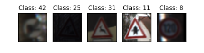
 
 The class id list can be found in the `CarND-Traffic-Sign-Classifier-Project/signnames.csv` file. 
 
 Let's look at a sample of 5 images for the class 35. 
 
 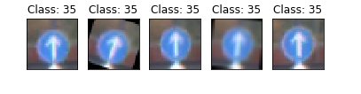
 
 We can see that we have images with different angles, different blurs. Looking into more examples, we could see that there are all different darkness and shadows.
 
 Here is a visualization of the classes for all the images in the training set.
 
 
 
 Some classes are a lot more represented than others, we can expect that those classes will be found more easily by the trained model. 
 
 ## Build and train the model
 #### Preprocessing the data set TODO add why
 In the preprocessing step, I took 2 steps: 
 * Normalize the RGB image on all three channels using: `normalized = (image - 128)/128`
 * Convert the original (non normalized) image to gray scale, and add it as a forth dimention to my image. 
 
 I found that those to steps combined improved the accuracy on the validation step. 
 
 The preprocessing steps are applied on each image before training the model, but also to the testing image, before it goes through the neural network.
 
 #### Model Architecture
 The model I chose is based on the LeNet architecture, with 2 convolution layers, and two fully connected layers.
 The shape off the image evolves following the following shapes through the `LeNet(x)` method: 
 
 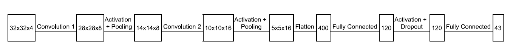

 Things to note: 
 * The activation layer uses an elu function rather than relu, which is a smoother way to activate a network. After testing on a few runs, I found that it leads to a better accuracy of the model
 * The pooling uses average pooling rather than max pooling. The average pooling keeps more information that we would have lost with the max pooling. 
 
 #### Hyper parameters
 In training the model, I started by using 10 epochs, looking at a plot of the Accuracy percentage, I could see that when I the training stopped, my accuracy was still growing. So I keep adding epochs until I got good result, and more than 93% accuracy. 
 I used the batch size of 128, and the learning rate is 0.001. 
 
 The final accuracy on the validation set of images is: 93.19% 
 
 ##  Test the model on new images  
 
 To test the model on new images, I took 5 pictures from google image, and made them into a close to a square shape.
 Converted them to  a 32x32 image, preprocessed them, then ran them through the `LeNet` method to get the logits for these pictures. 
 
 32x32 images: 
  
  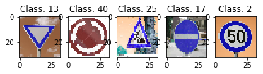
  
 For each image, let's have a look at the expectation vs result we had. 
  #### Caution sign, class 25
 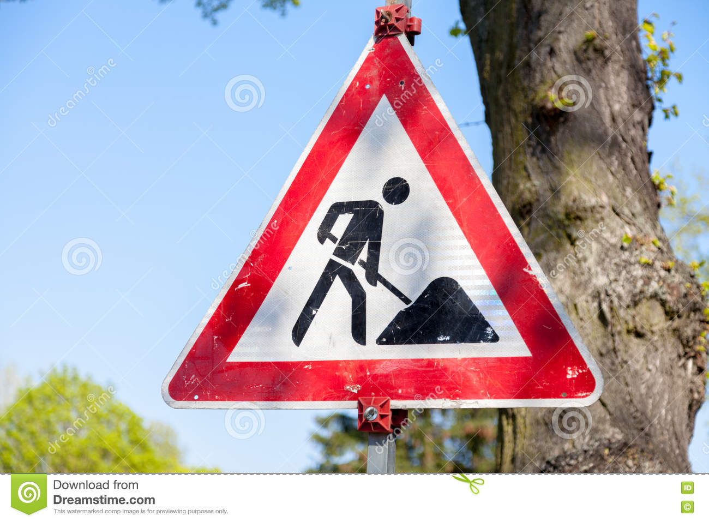 
 In this image the colors are pretty clear, but this is not a square image, when converting to a 32x32 image, the sign will be scaled differently on the x axis and the y axis (see above). 
 This would be a difficulty for the model. Let's have a look at the result: 
 
 Softmax representation of the logits:
  
  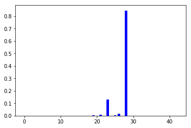
  
  We can see that the model is over 85% sure that this is a caution sign, as we expect. The perspective is probably the reason why we are not more sure of the result.
 
  #### Do not enter sign, class 17
 
 This do not enter sign shouldn't cause too much trouble for the model, as there is nothing too out of ordinary in it. I expect an softmax of 100% fir the class 17. 
 
 Softmax result:  
 
 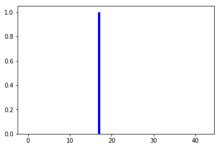
 
 As we can see this is this case. The model is 100% sure is it a do not enter sign. 
  ####50 km/h speed limit sign, class 2
 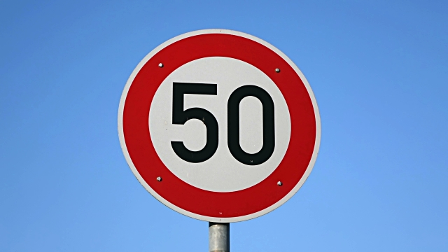
 
 Softmax result: 
 
 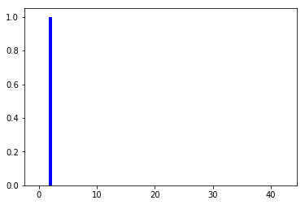
 
 We have a similar result as the case above,  and the same output. This sign is pretty clear, and the output probability is really high. 
  
 ####  Yield sign, class 13
 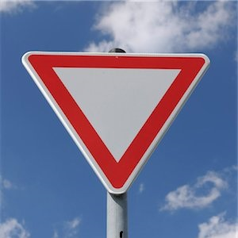 

 Softmax result: 
 
 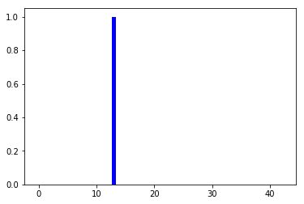
 
 #### Roundabout sign, class 40 - output class 35
  
 The roundabout sign is a little more complicated, it has a lot of copy right stamps on it, that might confurse our model. Let's run it: 
 

 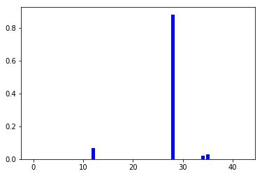
 
 Unfortunately, the model didn't recognize this sign, it miscategorized it as an ahead only sign. Some of it might be the color of the sign, and the white lines in the middle of the image. 
 Theo biggest shortcoming I can see here is how sure the model thinks it is an ahead only sign. 
 In the training set there are 3 times more straight ahead signs than round about signs. That probably explains why the model tends towars the straghtahead sign when the image is mostly blue.
 
#### Overall results
 
 The overall accuracy on those 5 images is: 0.8
 The validation set had a 93.2% accuracy, the test set has an accuracy that is lower, but it is not surprising as 1 image been misclassified affects the accuracy more than in a bigger set. 
 The one misclassified image is the roundabout one, with has a lot of copy right signs in it. This wouldn't happen in real life. 
 